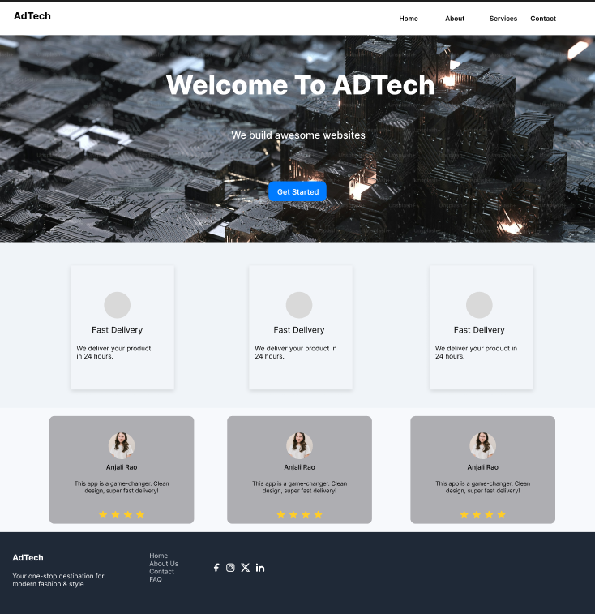

# AdTech Homepage Design (Figma)

This is a homepage UI/UX layout designed in Figma for AdTech — a modern fashion platform.

## 📦 Files Included
- `AdTech.fig` – The main Figma design file
- `/screenshots/` – Preview images of the design

## 🛠️ Tools Used
- Figma
- Iconify Plugin
- Google Fonts: Inter, Poppins

## 💡 How to Use
1. Download the `.fig` file
2. Open it in Figma (Import > File)

## 💡 Result
